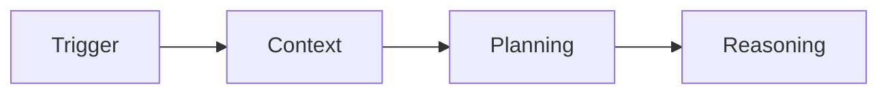

An AI agent in the context of this knowledge based is defined as a software that acts autonomously on given tasks by:
- using large language models for planning, reasoning and text generation. There are currently several large language model provides such as OpenAI, Anthropic and Google. 
- produces real outputs such as documents, emails draft and entries in databases
- using tools such file tools (create, read, edit), browser tools, API tools and others

An AI agent may or may not involve human-in-the-loop verification. 