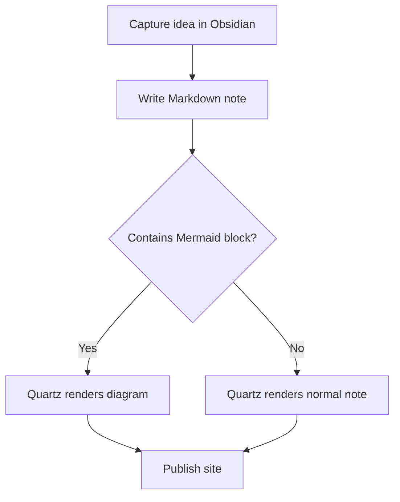

Welcome to the [[agentic AI]] for medical device clinical evidence generation. 

>[!Agent]
>Many have used large language model chatbots such as ChatGPT. Agents differ from chatbots in three ways: 1) The agents have memory and can take a wide medical device-specific context into account, 2) The agents actually do things other than replying to questions by writing documents, answering emails and making database entries 3) The agents can act autonomously without human intervention and when human at not actually interacting with them.

From [[processes]] point of view topics covered include among others:

- How to use agentic AI in literature search?
- How to analyze clinical evidence gaps with AI?
- How to review technical file with AI for traceability and consistency?
- How to ensure the teams knows the clinical evidence as expert-level knowledge?
- How to make content (presentations, emails) from clinical evidence with the help of AI?

The intended real world outcome is to help you to [[progress in implementing AI agents]] while at the same time remain acknowledge and mitigate [[risks of AI in clinical evidence generation]].  

> [!Intended users]
> Medical device professionals and companies planning and implementing agentic AI solutions for clinical evidence generation. Knowledge of clinical evidence generation is assumed. Knowledge of agentic AI is not assumed.

This knowledge base addresses the [[two application domains of clinical evidence]]: regulatory and commercial. A major practical issue for manufacturers is exclusive focus on the regulatory and neglect of the commercial application domain. More of this here: [[practical issues]]

You can [[use]] this knowledge base as a human reader or prompt your AI agent to use it. 

A good place to start is to start from the [[fundamentals]] or follow the [[guided paths]]

This knowledge based in maintained by [[me]] Markus and my [[AI-assistant]]. Unless explicitly stated otherwise, I am the author of the content. One the tasks of the assistant is to critique the knowledge base in [[ai-generated-critique]]

It would be wonderful if you want to [[engage]] with the knowledge base.

TEST

